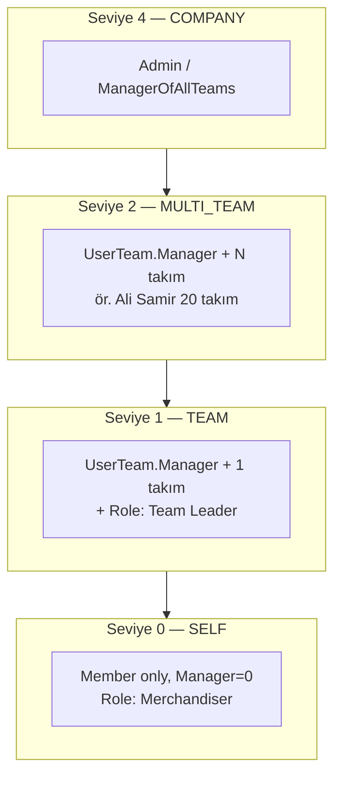

# NAPCO — Hiyerarşi ve Rol Keşif Notları

> Amaç: Chatbot RBAC için NAPCO tenant'ında hangi rollerin kullanıldığını ve hiyerarşinin DB'de nasıl tutulduğunu SQL ile adım adım keşfetmek.  
> DB: `WorkForce_Prod`  
> Durum: **Devam ediyor** (Katman özeti tamamlandı — sadece SubId 1238)

---

## Yol haritası — Adım numarası ↔ orijinal harf kodu

Aynı plan; sadece SSMS'te sırayla giderken **Adım 1, 2, 3…** kullanıyoruz.

| Sıra | Adım | Eski kod | Konu | Durum |
|------|------|----------|------|--------|
| 1 | Adım 1 | **A** | NAPCO subscription Id | ✅ |
| 2 | Adım 2 | **B1** | En çok kullanılan roller | ✅ |
| — | *(atla)* | **B2** | Öncelikli rol isimleri tek tek | ⏭️ B1 yeterli |
| — | *(opsiyonel)* | **B3** | Kullanılmayan roller | ⏭️ sonra |
| 3 | Adım 3 | **C1** | Takım lideri + ekip boyutu | ✅ |
| 4 | Adım 4 | **C2** | Çok takımlı yönetici (Ali) | ✅ |
| 5 | Adım 5 | **C4** | ManagerOfAllTeams / Admin | ⬅️ **sıradaki** |
| 6 | Adım 6 | **C5** | Liderlerin rol dağılımı | ⏳ |
| 4b | **Adım 4b** | **C3** | Tek manager → tüm ekip üyeleri (doğrulama) | ✅ |
| 7 | Adım 7 | **C6** | Team tablosu parent kolonu var mı? | ⏳ |
| 8 | Adım 8 | **C7** | Region–takım bağlantısı | ⏳ |

**Özet:** A → B1 → C1 ✅ bitti. Şimdi **C2 (Adım 4)**. B2/B3 ve C7'ye kadar hepsi aynı checklist; gereksiz olanları atlayabiliriz.

---

## Seçilen ana tenant

| Alan | Değer |
|------|--------|
| **SubscriptionId** | `1238` |
| **CompanyName** | NAPCO - Main Account |
| **SubscriptionGroup** | NAPCO |

*(Diğer NAPCO grubu hesapları: 1112, 1113, 1115, 1456, 1470 — gerekirse genişletilir.)*

---

## Adım 1 — NAPCO subscription listesi

**SQL:**

```sql
USE WorkForce_Prod;
GO

SELECT Id, CompanyName, SubscriptionGroup, Deleted
FROM dbo.Subscription
WHERE Deleted = 0
  AND (
    CompanyName LIKE N'%NAPCO%'
    OR SubscriptionGroup LIKE N'%NAPCO%'
  )
ORDER BY CompanyName;
```

**Sonuç (2026-06-05):**

| Id | CompanyName | SubscriptionGroup | Deleted |
|----|-------------|-------------------|---------|
| 1115 | Al amjeed | NAPCO | 0 |
| 1112 | NAPCO | NAPCO | 0 |
| 1456 | Napco | NULL | 0 |
| 1470 | Napco | NULL | 0 |
| **1238** | **NAPCO - Main Account** | NAPCO | 0 |
| 1113 | TARA | NAPCO | 0 |

**Karar:** Ana analiz `@SubId = 1238` (NAPCO - Main Account).

---

## Adım 2 — Subscription 1238: en çok kullanılan roller

**SQL:**

```sql
USE WorkForce_Prod;
GO

DECLARE @SubId BIGINT = 1238;

SELECT
  r.Id AS roleId,
  r.Name AS roleName,
  r.Code AS roleCode,
  r.DefaultAdmin,
  r.DefaultFieldForce,
  COUNT(DISTINCT ur.UserId) AS userCount
FROM dbo.UserRole ur
INNER JOIN dbo.Role r
  ON r.Id = ur.RoleId AND r.Deleted = 0
INNER JOIN dbo.[User] u
  ON u.Id = ur.UserId AND u.Deleted = 0
WHERE ur.Deleted = 0
  AND u.SubscriptionId = @SubId
GROUP BY r.Id, r.Name, r.Code, r.DefaultAdmin, r.DefaultFieldForce
ORDER BY userCount DESC, r.Name;
```

**Sonuç (2026-06-05):**

| roleId | roleName | roleCode | DefaultAdmin | DefaultFieldForce | userCount |
|--------|----------|----------|--------------|-------------------|-----------|
| 3538 | **Merchandiser** | NULL | 0 | **1** | **362** |
| 3590 | **Team Leader** | NULL | 0 | 0 | **44** |
| 3536 | **Admin** | NULL | **1** | 0 | 5 |
| 3591 | **Supervisor** | NULL | 0 | 0 | 5 |
| 4007 | **Senior Team Leader** | NULL | 0 | 0 | 4 |
| 4406 | User Report | NULL | 0 | 0 | 3 |
| 4378 | Report Coordinator | NULL | 0 | 0 | 2 |
| 3537 | Client | NULL | 0 | 0 | 1 |
| 4006 | Merchandising Section Head | NULL | 0 | 0 | 1 |

**İlk yorumlar:**

| Rol | Önerilen hiyerarşi seviyesi | Not |
|-----|----------------------------|-----|
| Merchandiser | **0 — SELF** | `DefaultFieldForce=1`, 362 kullanıcı → saha/field force |
| Team Leader | **1 — TEAM** | 44 kullanıcı → takım lideri (Ahmet modeli) |
| Senior Team Leader | **1 — TEAM** | Üst takım lideri |
| Supervisor | **1–2 — TEAM / MULTI_TEAM** | 5 kullanıcı |
| Merchandising Section Head | **2 — MULTI_TEAM** | Bölüm şefi |
| Admin | **4 — COMPANY** | `DefaultAdmin=1` |
| User Report / Report Coordinator | Rapor rolü | Chat hiyerarşisi ayrı değerlendirilecek |
| Client | **0 — SELF** | Müşteri tarafı, farklı metrik seti |

**NAPCO Main için öncelikli chat rolleri (revize):**

1. Merchandiser (3538) — saha  
2. Team Leader (3590) — takım lideri  
3. Senior Team Leader (4007)  
4. Supervisor (3591)  
5. Merchandising Section Head (4006)  
6. Admin (3536)  

---

## Adım 3 — Takım lideri sayısı ve örnek ekip (C1)

**SQL:**

```sql
USE WorkForce_Prod;
GO

DECLARE @SubId BIGINT = 1238;

SELECT
  COUNT(DISTINCT ut.UserId) AS managerUserCount,
  COUNT(*) AS managerTeamLinks
FROM dbo.UserTeam ut
INNER JOIN dbo.[User] u ON u.Id = ut.UserId AND u.Deleted = 0
INNER JOIN dbo.Team t ON t.Id = ut.TeamId AND t.Deleted = 0
WHERE ut.Deleted = 0
  AND ut.Manager = 1
  AND u.SubscriptionId = @SubId;

SELECT TOP 15
  mgr.Id AS managerUserId,
  mgr.Name AS managerName,
  mgr.Email AS managerEmail,
  t.Id AS teamId,
  t.Name AS teamName,
  COUNT(DISTINCT ut2.UserId) AS teamMemberCount
FROM dbo.UserTeam ut
INNER JOIN dbo.[User] mgr ON mgr.Id = ut.UserId AND mgr.Deleted = 0
INNER JOIN dbo.Team t ON t.Id = ut.TeamId AND t.Deleted = 0
LEFT JOIN dbo.UserTeam ut2 ON ut2.TeamId = t.Id AND ut2.Deleted = 0
WHERE ut.Deleted = 0
  AND ut.Manager = 1
  AND mgr.SubscriptionId = @SubId
GROUP BY mgr.Id, mgr.Name, mgr.Email, t.Id, t.Name
ORDER BY teamMemberCount DESC;
```

**Sonuç özeti (2026-06-05):**

| Metrik | Değer |
|--------|--------|
| **managerUserCount** | 54 |
| **managerTeamLinks** | 148 |

**Örnek bulgular:**

- Aynı takımda **birden fazla manager** olabiliyor (ör. Team **1307** WP-Dipatuan Abdulmanan, 34 üye → 5 farklı manager satırı).
- **Amer Maher Haffar (12497)** birden fazla takımda manager (1307, 1313, 1312…).
- Takım isimleri `WP-...` prefix (workplace / saha ekibi).

**Yorum (Ahmet modeli):**

- Hiyerarşi **ayrı “üst yönetici” tablosu olmadan** büyük ölçüde `UserTeam.Manager = 1` ile kuruluyor.
- Bir kişi hem kendi ekibinin hem başka takımların manager'ı olabilir → **MULTI_TEAM** C2 ile doğrulanacak.

---

## Adım 4 — Birden fazla takım yöneten kullanıcılar (C2 — Ali modeli)

**SQL:**

```sql
USE WorkForce_Prod;
GO

DECLARE @SubId BIGINT = 1238;

SELECT
  u.Id AS userId,
  u.Name,
  u.Email,
  COUNT(DISTINCT ut.TeamId) AS managedTeamCount
FROM dbo.UserTeam ut
INNER JOIN dbo.[User] u ON u.Id = ut.UserId AND u.Deleted = 0
INNER JOIN dbo.Team t ON t.Id = ut.TeamId AND t.Deleted = 0
WHERE ut.Deleted = 0
  AND ut.Manager = 1
  AND u.SubscriptionId = @SubId
GROUP BY u.Id, u.Name, u.Email
HAVING COUNT(DISTINCT ut.TeamId) > 1
ORDER BY managedTeamCount DESC;
```

**Sonuç (2026-06-05) — 12 kullanıcı, 2+ takım:**

| userId | Name | Email | managedTeamCount |
|--------|------|-------|------------------|
| 12600 | Ali Samir Hassan | 1ali.samir@napconational.com | **20** |
| 12601 | Habib Miro Banog | 1habibmiro.banog@napconational.com | **20** |
| 12790 | Mohamed Ahmed Abdelmaksoud | 1Mohamed.Maksoud@napconational.com | 9 |
| 12791 | Fouad Fadi Elhelou | 1Fouad.Elhelou@napconational.com | 9 |
| 12498 | Saud Baraka | 1Saud.bar39@gmail.com | 9 |
| 12499 | Ibrahim Fathi Ibrahim | 1Ibrahim.Fathi@napconational.com | 9 |
| 12536 | Mahmoud Khaled Shalan | 1mahmoudshallan333@icloud.com | 8 |
| 12500 | Arif Eqbal | 1Arifnapco93@gmail.com | 5 |
| 12497 | Amer Maher Haffar | 1Amer.Haffar@napconational.com | 5 |
| 12563 | Ayman Yunis | 1Ayman.Younes@napconational.com | 4 |
| 12899 | Hatem Abdo Abdullah Ali Katheree | 1Hatem.Katheree@napconational.com | 4 |
| 13309 | Abdullah Dkheel Alnakhli | 1Abdullah.Alnakhli@napconational.com | 4 |

**Yorum (Ali modeli — netleşti):**

- **Ayrı “Ali → Ahmet” üst yönetici tablosu yok** (en azından bu sorguda görünmüyor).
- **Üst yönetici = `UserTeam.Manager = 1` olan ve birden fazla takımda manager kaydı olan kullanıcı.**
- Ali Samir / Habib Miro → **20 takım** → Seviye **2 MULTI_TEAM** (veya üstü).
- Amer Haffar → **5 takım** → aynı mekanizma, daha dar kapsam.
- Chat hiyerarşisi için `allowedUserIds` = kendisi + yönettiği tüm takımların üyeleri (birleşik liste).

**Örnek test kullanıcıları (ileride):**

| Senaryo | userId | Email |
|---------|--------|-------|
| Çok takımlı üst yönetici | 12600 | 1ali.samir@napconational.com |
| Orta seviye çok takım | 12497 | 1Amer.Haffar@napconational.com |
| Tek takım lideri | *(Adım 6/C5 sonrası)* | — |
| Saha | Merchandiser | *(Adım 2)* | — |

---

## Adım 4b — Tek yöneticinin gördüğü kişiler (C3 — doğrulama)

> **Not:** Bu sorgu tek kişi içindir (örnek). Üretim chatbot'u login olan **her kullanıcı** için aynı mantığı dinamik uygulamalıdır — aşağıdaki "Katmanlı model" bölümüne bak.

**SQL:** `@ManagerEmail = N'1Amer.Haffar@napconational.com'`

**Sonuç özeti (Amer Maher Haffar, 12497):**

- Yönettiği takımlar (örnek): **1307, 1309, 1310, 1312, 1313** (`WP-...` ekipleri)
- Satır sayısı ~**80+** (takım × üye); **distinct member** sayısı özet sorgu ile alınmalı
- Amer hem **manager** hem **member** aynı takımlarda (`Manager=1`, `Member=1`)
- Aynı takımda **başka manager'lar** da var (Adım 3 ile uyumlu — co-manager yapısı)

**C3'ten çıkan tasarım uyarıları:**

1. NAPCO'da "Ahmet + 5 kişilik tek ekip" basit modeli **her zaman geçerli değil**; çok takım + ortak manager yaygın.
2. `allowedUserIds` = yönetilen takımların **tüm UserTeam üyeleri** (distinct) olmalı.
3. Co-manager'lar aynı veriyi görür; bu DB gerçeği, bug değil.
4. Tek email'e sabit SQL ≠ katmanlı sistem; kodda **seviye + login userId** ile hesaplanmalı.

---

## Katmanlı erişim modeli (tasarım — onay bekliyor)

DB'de `Ali → Ahmet → saha` şeklinde **ayrı reporting line tablosu yok**. Katmanlar **türetilir**:



| Seviye | DB sinyalleri | allowedUserIds nasıl dolar? |
|--------|---------------|----------------------------|
| **0 SELF** | `UserTeam.Manager=0` (veya manager takım yok), rol Merchandiser | `{userId}` |
| **1 TEAM** | `Manager=1`, `managedTeamCount=1` | `{userId} ∪ o takımın üyeleri` |
| **2 MULTI_TEAM** | `Manager=1`, `managedTeamCount>1` | `{userId} ∪ tüm yönetilen takımların üyeleri` |
| **4 COMPANY** | `User.Admin=1` veya `ManagerOfAllTeams=1` veya rol Admin | tenant geneli (kontrollü) |

**Rol (`dbo.Role`) + takım (`UserTeam`) birlikte:**

- Rol → hangi **intent** sorulabilir (Merchandiser vs Team Leader)
- UserTeam → hangi **UserId'lerin verisi** SQL'e girer

**Yapılacak (kod — henüz onay yok):**

1. `resolveHierarchyLevel(userId)` → 0/1/2/4
2. `buildAllowedUserIds(userId, level)` → C3 mantığı, email sabit değil `@userId`
3. Admin scope (country/brand) ile **UserId listesini çakıştırma** — hiyerarşi birincil

**Tüm kullanıcıları katmanlayan doğrulama SQL'i (sonraki adım):**

*(Aşağıda düzeltilmiş CTE versiyonu + sonuç)*

---

## Katman özeti — sadece Subscription 1238 (NAPCO - Main Account)

**Evet — bu sorgu tek şirket / tek subscription için.**

| Filtre | Değer |
|--------|--------|
| `@SubId` | **1238** |
| CompanyName | NAPCO - Main Account |

Diğer NAPCO grubu hesapları (1112, 1113, 1115…) **bu tabloda yok**.

**Sonuç (2026-06-05):**

| katman | Anlam | kisiSayisi |
|--------|--------|------------|
| **1** | Saha — sadece kendi | **411** |
| **2** | Tek takım yöneticisi | **42** |
| **3** | Çok takım yöneticisi (2+) | **12** |
| **4** | Admin / ManagerOfAllTeams | **8** |
| | **Toplam** | **473** |

**SQL (CTE — GROUP BY hatası düzeltilmiş):**

```sql
USE WorkForce_Prod;
GO
DECLARE @SubId BIGINT = 1238;

WITH UserStats AS (
  SELECT u.Id, u.Admin, u.ManagerOfAllTeams,
    MAX(CASE WHEN ut.Manager = 1 THEN 1 ELSE 0 END) AS isTeamManager,
    COUNT(DISTINCT CASE WHEN ut.Manager = 1 THEN ut.TeamId END) AS managedTeamCount
  FROM dbo.[User] u
  LEFT JOIN dbo.UserTeam ut ON ut.UserId = u.Id AND ut.Deleted = 0
  WHERE u.Deleted = 0 AND u.SubscriptionId = @SubId
  GROUP BY u.Id, u.Admin, u.ManagerOfAllTeams
),
UserKatman AS (
  SELECT Id,
    CASE
      WHEN Admin = 1 OR ManagerOfAllTeams = 1 THEN 4
      WHEN managedTeamCount > 1 THEN 3
      WHEN isTeamManager = 1 THEN 2
      ELSE 1
    END AS katman
  FROM UserStats
)
SELECT katman, COUNT(*) AS kisiSayisi
FROM UserKatman
GROUP BY katman
ORDER BY katman;
```

**Tüm NAPCO grubu için:** `@SubId` yerine `u.SubscriptionId IN (1112,1113,1115,1238,...)` veya `SubscriptionGroup = 'NAPCO'` join kullanılır.

---

## Adım 5 — (planlanan) ManagerOfAllTeams / Admin kullanıcıları

```sql
DECLARE @SubId BIGINT = 1238;

SELECT Id, Name, Email, ManagerOfAllTeams, Admin
FROM dbo.[User]
WHERE Deleted = 0
  AND SubscriptionId = @SubId
  AND (ManagerOfAllTeams = 1 OR Admin = 1)
ORDER BY Name;
```

---

## Adım 6 — (planlanan) Takım liderlerinin rol dağılımı

```sql
DECLARE @SubId BIGINT = 1238;

SELECT
  r.Name AS roleName,
  COUNT(DISTINCT u.Id) AS managerCount
FROM dbo.[User] u
INNER JOIN dbo.UserTeam ut ON ut.UserId = u.Id AND ut.Deleted = 0 AND ut.Manager = 1
INNER JOIN dbo.UserRole ur ON ur.UserId = u.Id AND ur.Deleted = 0
INNER JOIN dbo.Role r ON r.Id = ur.RoleId AND r.Deleted = 0
WHERE u.Deleted = 0
  AND u.SubscriptionId = @SubId
GROUP BY r.Name
ORDER BY managerCount DESC;
```

---

## Adım 7 — (planlanan) Team tablosu hiyerarşi kolonları

```sql
SELECT COLUMN_NAME, DATA_TYPE
FROM INFORMATION_SCHEMA.COLUMNS
WHERE TABLE_SCHEMA = 'dbo' AND TABLE_NAME = 'Team'
ORDER BY ORDINAL_POSITION;
```

---

## Hiyerarşi hedef modeli (taslak — onay bekliyor)

| Seviye | Mod | NAPCO karşılığı (ilk tahmin) |
|--------|-----|------------------------------|
| 0 | SELF | Merchandiser |
| 1 | TEAM | Team Leader, Senior Team Leader, Supervisor |
| 2 | MULTI_TEAM | Merchandising Section Head, çok takımlı Manager |
| 4 | COMPANY | Admin |

**Ali–Ahmet hiyerarşisi:** Adım 4 ✅ — üst yönetici = çok takımlı `UserTeam.Manager`; Ali Samir (12600) 20 takım. Kodda `allowedUserIds` = yönetilen takımların tüm üyeleri + kendisi.

---

## Referans

- Genel rol listesi: kullanıcı tarafından paylaşıldı (yüzlerce `dbo.Role.Name`)
- Öncelikli 12 rol listesi: onaylandı; NAPCO Main gerçeği yukarıdaki 6 role indirgenebilir
- Kod: `userContextService.js` → `allowedUserIds`, `managedTeamIds`, `UserTeam.Manager`
